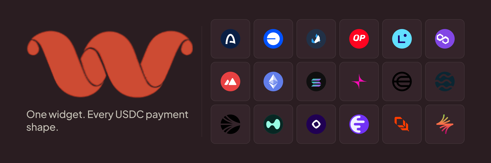

# Whisk

**Embeddable USDC send & bridge widget, built on Circle App Kit.**

Drop-in React component. Same interface for same-chain sends and cross-chain bridges. Multi-chain. Pluggable recipient resolution. MIT-licensed.

[](https://www.npmjs.com/package/@usewhisk/react)
[](https://www.npmjs.com/package/@usewhisk/core)
[](./.github/workflows/ci.yml)
[](LICENSE)
[](https://www.typescriptlang.org/)
[](CONTRIBUTING.md)
[](https://docs.arc.network/app-kit)

---

## What is Whisk?

Whisk is the embeddable USDC widget you wish came with Circle App Kit. Drop a single React component into your app, configure a few chains, and your users can:

- **Send** USDC to any address on the same chain
- **Bridge** USDC across chains (Arc Testnet, Base, Ethereum, Solana, and more)
- Pay through **any wallet** (MetaMask, Phantom, WalletConnect, Rabby, Circle Wallets)
- See a **transparent fee breakdown** before confirming
- Watch the transfer progress through every step (`approve` → `burn` → `attestation` → `mint`)

Whisk wraps Circle's [App Kit](https://docs.arc.network/app-kit) so you don't have to think about CCTP, Gateway, attestations, or chain-specific quirks. One method for sends. One method for bridges. Same interface, same UX.

```tsx
<WhiskProvider config={config}>
  <WhiskSend onSuccess={(r) => console.log("done:", r.finalTxHash)} />
</WhiskProvider>
```

That's it. The widget handles wallet connection, chain switching, recipient validation, fee preview, and the whole transaction lifecycle. Chains, fee policy, RPC overrides, and resolvers live on the provider config (see Quickstart below).

---

## Why Whisk?

Circle App Kit gives you the SDK. The remaining 80% is still on you:

- Designing the UI for a multi-step bridge state machine
- Wiring up wallet connection across EVM **and** Solana
- Validating addresses per-chain (EVM hex vs Solana base58)
- Surfacing fees transparently (CCTP, Gateway, custom, gas, forwarder)
- Showing per-step progress (`approve` → `burn` → `attestation` → `mint`)
- Handling retries on bridge failures
- Building a recipient-resolution layer (paste address, ENS, email, phone…)

That's the work Whisk does once, well, and ships as a widget so you can spend your time on the rest of your product.

---

## Quickstart

### Install

```bash
# pnpm
pnpm add @usewhisk/react

# npm
npm install @usewhisk/react

# yarn
yarn add @usewhisk/react
```

### Drop it in

```tsx
import {
  WhiskProvider,
  WhiskSend,
  createWhiskConfig,
  evm,
} from "@usewhisk/react";
import "@usewhisk/react/styles.css";

const config = createWhiskConfig({
  wallets: [evm({ projectId: process.env.WALLETCONNECT_PROJECT_ID! })],
  chains: ["Arc_Testnet", "Base_Sepolia", "Ethereum_Sepolia"],
  defaultDestinationChain: "Arc_Testnet",
});

export default function App() {
  return (
    <WhiskProvider config={config}>
      <WhiskSend />
    </WhiskProvider>
  );
}
```

That's the entire integration.

### Add Solana support

Just add the `solana()` adapter. Tree-shakeable — Solana code only enters your bundle when imported.

```tsx
import { evm, solana } from "@usewhisk/react";

const config = createWhiskConfig({
  wallets: [evm(), solana()],
  chains: ["Arc_Testnet", "Solana_Devnet"],
});
```

### Custom theme via CSS variables

```css
[data-whisk] {
  --whisk-primary: 142 71% 45%;
  --whisk-radius: 0.75rem;
  --whisk-font: "Inter", system-ui, sans-serif;
}
```

### Custom theme via Tailwind preset (optional)

```js
// tailwind.config.js
import { whiskTheme } from "@usewhisk/react/tailwind";

export default {
  presets: [whiskTheme()],
  // ...
};
```

---

## Features

| Capability               | Notes                                                                       |
| ------------------------ | --------------------------------------------------------------------------- |
| **Send (same-chain)**    | Direct ERC-20 / SPL transfer. EOA or SCA on EVM; EOA on Solana.             |
| **Bridge (cross-chain)** | CCTP v2 under the hood. Approve → burn → attestation → mint, all automatic. |
| **Swap (same-chain)**    | Stablecoin ↔ stablecoin via App Kit Swap. Live preview, slippage / stop-limit. |
| **Smart routing**        | Whisk picks `send` vs `bridge` from the source/destination chains.          |
| **Multi-chain**          | 18 EVM chains + Solana. Arc, Base, Ethereum, Polygon, Avalanche, more.      |
| **Multi-wallet**         | Ecosystem-first connect modal — EVM (MetaMask, Coinbase, WalletConnect, Rabby) and Solana (Phantom, Solflare, Backpack) never collide. |
| **Recipient resolvers**  | Address + ENSIP-11 multichain ENS built in; bring your own (email, phone…). |
| **Fee transparency**     | Custom + protocol + gas + forwarder, displayed before confirm.              |
| **Progress streaming**   | Live step state from App Kit's bridge events.                               |
| **Mid-flight recovery**  | Burn-but-no-mint failures: in-tab retry, cross-refresh persistence (localStorage, 48h), manual-mint escape hatch via direct `MessageTransmitter.receiveMessage`. |
| **Pre-flight checks**    | Read-only balance / gas / chain-alignment inspection before the user signs. |
| **Cross-tab safety**     | `BroadcastChannel` lock prevents two tabs racing a CCTP burn on the same wallet. |
| **Mode-aware**           | `testnet` / `mainnet` first-class. Visible Testnet pill, Sepolia-first ENS, mode-namespaced persistence. |
| **Headless mode**        | `useWhisk()` hook for full UI control.                                      |
| **Theming**              | CSS variables (override `--whisk-*` for full rebrand) + optional Tailwind preset. |
| **Open source**          | MIT. Read every line, fork it, ship your own.                               |

---

## Architecture

Whisk is a small monorepo. Two packages, two consumers.

```
whisk/
├── packages/
│   ├── core/         # @usewhisk/core   — framework-agnostic engine
│   └── react/        # @usewhisk/react  — components, hooks, provider
├── examples/
│   └── playground/ # Drop-in showcase + playground
└── apps/
    └── docs/         # Documentation site (Fumadocs)
```

- **`@usewhisk/core`** — pure TypeScript. No React, no DOM, no wallet imports. Exports the `createWhisk()` engine plus the chain registry, fee logic, resolver composition, routing, error classes, and state-machine reducer.
- **`@usewhisk/react`** — components, hooks, and the provider. Wraps wagmi (EVM) and `@solana/wallet-adapter-react` (Solana) and hands a typed `WhiskAdapter` to the engine. Ships `<WhiskSend>` (drop-in) and `useWhisk()` (headless) — same engine underneath.

Deeper design docs — engine boundary, state machine, fee model, resolvers, errors — live on [the documentation site](https://www.usewhisk.xyz/docs) (or `apps/docs/` in this repo).

---

## Supported chains

| Network              | Chain ID                | Send | Bridge | Account types   |
| -------------------- | ----------------------- | :--: | :----: | --------------- |
| Arc Testnet          | `Arc_Testnet`           |  ✅  |   ✅   | EOA, SCA        |
| Solana Devnet        | `Solana_Devnet`         |  ✅  |   ✅   | EOA             |
| Ethereum Sepolia     | `Ethereum_Sepolia`      |  ✅  |   ✅   | EOA, SCA        |
| Base Sepolia         | `Base_Sepolia`          |  ✅  |   ✅   | EOA, SCA        |
| Arbitrum Sepolia     | `Arbitrum_Sepolia`      |  ✅  |   ✅   | EOA, SCA        |
| Optimism Sepolia     | `Optimism_Sepolia`      |  ✅  |   ✅   | EOA, SCA        |
| Polygon Amoy         | `Polygon_Amoy_Testnet`  |  ✅  |   ✅   | EOA, SCA        |
| Avalanche Fuji       | `Avalanche_Fuji`        |  ✅  |   ✅   | EOA, SCA        |
| Monad Testnet        | `Monad_Testnet`         |  ✅  |   ✅   | EOA, SCA        |
| Unichain Sepolia     | `Unichain_Sepolia`      |  ✅  |   ✅   | EOA, SCA        |
| Mainnet equivalents  | (same names, no suffix) |  ✅  |   ✅   | varies          |

Adding a chain = a single new entry in `packages/core/src/chains/registry.ts`.

---

## Theming

Whisk ships with a default theme (warm earth-tones) driven by `--whisk-*` CSS variables on `[data-whisk]`. Override any of them in your own stylesheet to retune the whole widget — light mode, dark mode, accent, border radius, fonts, the lot. The playground's palette picker (Wine / Indigo / Emerald / Amber) does exactly this — see `examples/playground/src/app/globals.css` for the full pattern.

```css
/* Override the widget's defaults — values are plain CSS colour strings. */
[data-whisk] {
  /* surfaces */
  --whisk-bg: #f5f6fc;
  --whisk-fg: #1e1b4b;
  --whisk-fg-muted: #4f4d80;
  --whisk-border: #c0c4ea;
  --whisk-card: #ffffff;
  --whisk-card-fg: var(--whisk-fg);

  /* accent (CTA, primary button) */
  --whisk-primary: #6366f1;
  --whisk-primary-fg: #ffffff;

  /* shape + type */
  --whisk-radius: 0.625rem;
  --whisk-font: "Inter", system-ui, sans-serif;
}

[data-whisk][data-whisk-theme="dark"] {
  --whisk-bg: #1a1c3d;
  --whisk-fg: #e2e2f5;
  /* … */
}
```

Tailwind users can opt into the preset for first-class token mapping:

```js
// tailwind.config.js
import { whiskTheme } from "@usewhisk/react/tailwind";

export default {
  presets: [whiskTheme()],
};
```

---

## Security model

- **No private keys ever touch Whisk.** The widget is browser-side; signing happens in the user's wallet. Whisk is a UI shell over App Kit's adapters.
- **No telemetry.** Nothing phones home.
- **Open source under MIT.** Audit every line. Fork it. Ship your own.
- **Type-safe end to end.** Engine is fully bound to App Kit's exported types. No `any` casts in the source.
- **Branch protection.** `main` is protected; every change goes through PR review including changes from the maintainer.
- **CodeQL on every PR.** Static analysis catches injection, XSS, prototype pollution, weak crypto, hardcoded credentials, etc.
- **Dependabot** keeps dependencies fresh; major bumps of load-bearing deps (Next, React, Circle App Kit) are gated for human review.

---

## Contributing

Whisk is community-maintained. Anyone can:

- File a bug or feature request → [open an issue](https://github.com/Signor1/whisk/issues)
- Improve the code → fork the repo, branch off `main`, open a pull request
- Improve the docs → same flow; small docs PRs are very welcome

Read [CONTRIBUTING.md](CONTRIBUTING.md) for development setup, project layout, PR conventions, and the security-disclosure flow. The `main` branch is protected — every change lands via PR review, including changes from the maintainer.

### Local development

```bash
git clone https://github.com/Signor1/whisk.git
cd whisk
pnpm install
pnpm -r build       # build all packages
pnpm -r typecheck   # strict type-check all packages
pnpm -r test        # run all package tests
```

---

## Acknowledgements

- Built on [Circle App Kit](https://docs.arc.network/app-kit) — the SDK doing the heavy lifting underneath.
- Inspired by [Uniswap Widgets](https://github.com/Uniswap/widgets), [shadcn/ui](https://ui.shadcn.com/) for the theming approach, and [wagmi](https://wagmi.sh/) for the config-driven adapter pattern.
- Not affiliated with Circle in any official sense — Whisk is a community widget over Circle's public SDK.

---

## License

[MIT](LICENSE) · Built by [SignorDev](https://github.com/Signor1)
